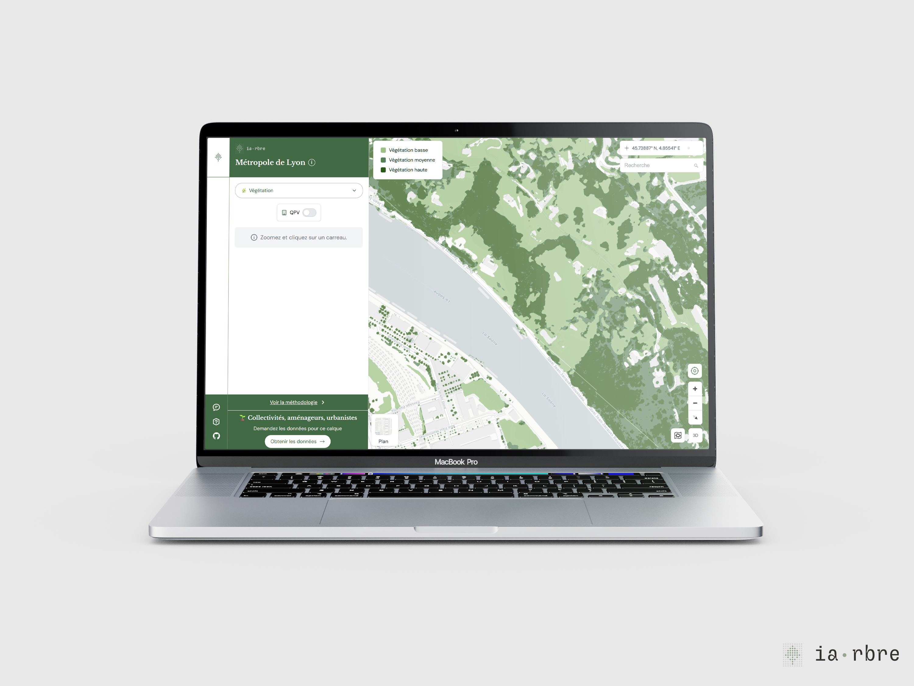

## L'origine de cet inventaire stratifié

Nous avions identifié comme un enjeu de maitriser le processus depuis les données jusqu'au résultat, afin de pouvoir mettre à jour selon notre calendrier et comparer la végétalisation avec le même référentiel au fil des années.

## Notre méthode

Avec l'aide du LIRIS nous avons donc élaboré notre propre méthode. Cette méthode repose sur le modèle d'IA [FlairHub](https://ignf.github.io/FLAIR/FLAIR-HUB/flairhub_fr.html) de l'IGN pour la reconnaissance sur les orthophotos. Notre méthode est partagée en ligne [ici](https://github.com/TelesCoop/vegestrate).

Elle est automatisée : se connecte aux sources de données de data.grandlyon (ou IGN en option) LiDAR et orthophotos aériennes.
Nous utilisons d'un côté la classification des nuages de points LIDAR et par ailleurs la classification des orthophotos à l'aide de FLAIR-HUB de l'IGN puis les deux classifications sont fusionnées.

 La précision de la classification, taille d'un pixel, est un carré de **20cmsx20cms**. Cette résolution a été choisie car le modèle FLAIR-HUB a été entraîné sur des images à cette résolution.

## Limites

La qualité du résultat est très dépendante du LIDAR qui reste la meilleure manière de classifier la végétation, hors zones herbacées, de manière précise (résolution de l'ordre du mètre). La métropole de Lyon produit une couverture du territoire en THD (100 points par m2 en zone urbaine dense et 30 ailleurs) ce qui permet une classification très précise. En zone urbaine dense, c'est parfois trop car on a des points qui traversent le couvert arboré et se retrouvent classés en zone herbacée qui est en dessous. Comme évoqué plus haut, le LIDAR pert en précision dans les zones proches des bâtiments.

Le modèle FLAIR-HUB permet à une résolution très compétitive, 20cm, des détections de zones herbacés très précises. Le modèle se comporte également très bien dans les zones proches des bâtiments où le LIDAR est moins bon.

Nous ne disposons pas de vérité terrain à l'échelle de la Métropole, car cette donnée n'existe pas, qui permetterait de calculer des métriques quantitatives de performance. Pour évaluer la performance nous sommes dépendants d'évaluations qualitatives avec les orthophotos en dessous de plan ou à l'aide d'experts d'un territoire précis.

Plus de détails également dans le documentation [ici](https://docs.iarbre.fr/methodology/vegetation/).
