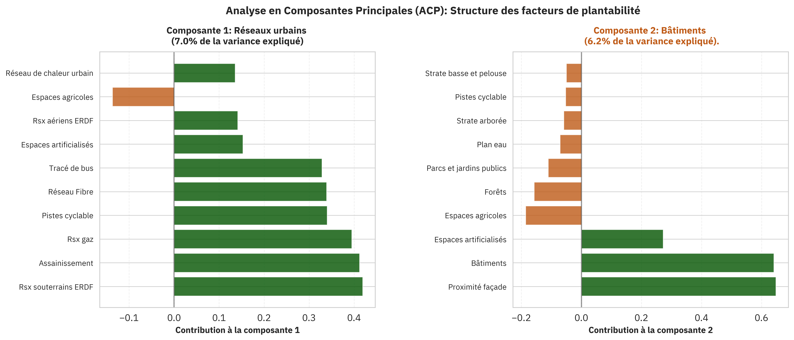
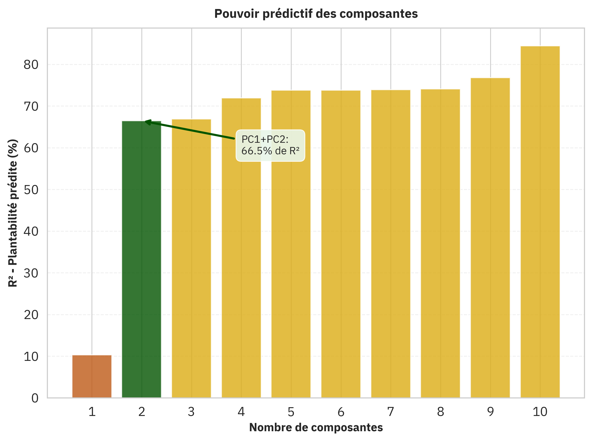

## L'origine du calque

La question de base qui avait été posée au gestionnaire d'espace public est "Qu'est ce qui fait qu'il est facile ou difficile de planter un arbre sur l'espace public ?". Cette question a permis de lister un certain nombre de **facteur.**

Il y a eu ensuite un travail collaboratif toujours des gestionnaires d'espace publics pour pondérer ces facteurs entre `-5` et `+5`. `+5` étant un facteur très favorisant et `-5` un facteur absolument bloquant. La transformation d'une zone est envisagée, ainsi une place de stationnement est un facteur bloquant mais pas absolument bloquant comme peut l'être un bâtiment ou le Rhône.
Ces facteurs ont ensuite été traduit en données existantes.

## Influence des facteurs sur le score de plantabilité

Il y a 35 facteurs différents ce qui rend l'analyse directe un peu plus difficile. C'est pourquoi nous avons appliqué sur les données une [analyse en composantes principales (ACP)](https://fr.wikipedia.org/wiki/Analyse_en_composantes_principales).  L'ACP va nous permettre d'identifier des groupes de facteurs importants dans les données et qui fonctionnent ensemble (ou en opposé). Nous verrons ensuite le lien entre ces composantes principales et la plantabilité.

### Les axes principaux dans les données

On va chercher dans les données des nouveaux axes, des combinaisons linéaires de facteurs, qui permettent de conserver l'essentiel de l'information. Ces combinaisons de facteurs (leur somme pondérée) sont indépendants entre eux.
Ce qui va nous permettre d'identifier des groupes de facteurs qui expliquent bien la structure des données et ces groupes seront distincts. Cette première analyse est complètement indépante de la plantabilité mais renseigne juste sur la structure des données en tant que tel.

On a un premier groupe qui explique pour 7% la variance des données et qui contient principalement les réseaux urbains. Dans ce groupe les réseaux souterrains ERDF, assainissement et réseaux de gazs sont les plus importants, on retrouve ensuite les réseaux de transport en surface. On voit aussi qu'il y a les espace agricoles mais avec une contribution négative, cela veut dire que cette variable évolue de manière opposée aux autres.
Dans le 2ème groupe, les variables les plus importantes sont les bâtiments et les facades.

On identifie donc deux types de zone très présentes dans les données : des zones avec des réseaux urbains et des zones bâties. Ce n'est pas très surprenant vu que l'on s'intéresse à la Métropole de Lyon.

### Prédiction de la plantabilité

On voit qu'en ne prennant que les composantes principales 1 et 2, qui sont elles même des combinaisons d'une dizaine de facteurs. On explique 66% du score de plantabilité. L'ajout de composantes supplémentaires apporte beaucoup moins d'explicabilité.
La composante 2, celle liée aux bâtiments est celle qui explique le plus de la plantabilité. Ce qui veut dire que le facteur principal qui va bloquer la plantation sur les 533.7km2 de la Métropole de Lyon est le bâti. Ce sera ensuite les réseaux urbains qui seront un frein à la plantation.
