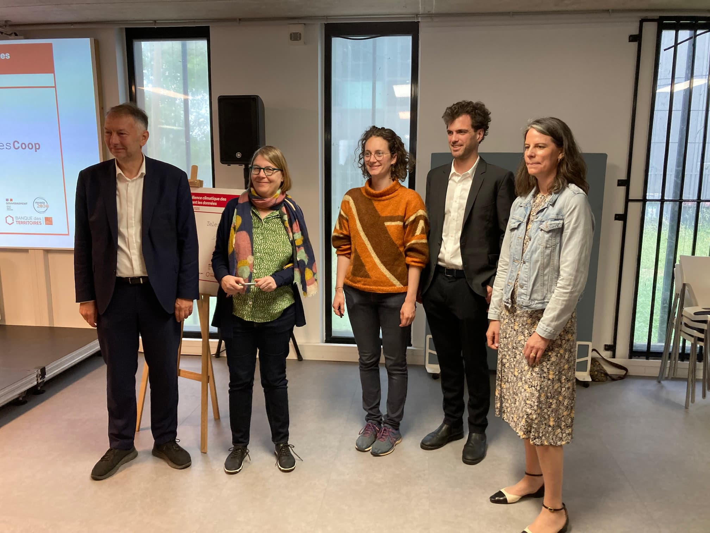

# 🌳 **IA.rbre a pris racine... officiellement !** 🚀

Après des mois de travail en coulisses, le projet **IA.rbre** a été lancé publiquement en novembre 2024. Il était grand temps de le célébrer avec vous ! 🎉

La matinée a débuté par un temps presse riche en découvertes !
🗺️ Une déambulation immersive avec plusieurs temps forts :

- Retour sur la genèse du projet, illustrée par la maquette augmentée et le calque V1 réalisé par [**Exo-Dev**](https://exo-dev.fr/)
- Présentation des premières avancées de la [plateforme **IA.rbre**](https://carte.iarbre.fr) 🌿
- Démonstration du **calculateur d’[itinéraires fraîcheur & pollen](https://cartes.lyon.fr/lieux-et-parcours-frais/)** de la Métropole 🌬️🌸

🎤 Trois figures institutionnelles nous ont ensuite honoré de leurs prises de parole :

- **Agnès Sindou-Faurie**, Directrice régionale adjointe de la Banque des Territoires
- **Isabelle von Bueltzingsloewen**, Présidente de l’Université Lumière Lyon 2
- **Bruno Bernard**, Président de la Métropole de Lyon

✍️ Un moment symbolique a suivi : la signature de la convention par **Camile Legeron** (co-gérante de **Telescoop**) aux côtés de Bruno Bernard et Isabelle von Bueltzingsloewen.

☕ La matinée s'est conclue autour d’un temps convivial et d'échanges avec les médias présents.
Et bonne nouvelle : les **premières retombées presse** sont déjà là !
📰 [_Lyon Capitale_](https://www.lyoncapitale.fr/environnement/ia-arbre-comment-la-metropole-de-lyon-va-utiliser-l-ia-pour-adapter-la-ville-au-changement-climatique)
📰 [_AEFinfo_](https://www.aefinfo.fr/depeche/731716-developpe-a-lyon-le-projet-iarbre-doit-faciliter-les-politiques-de-vegetalisation-du-territoire)

✨ **Une belle réussite selon tous.tes** et ce n'est que le début ! Hâte de vous dévoiler la suite du projet IA.rbre !
