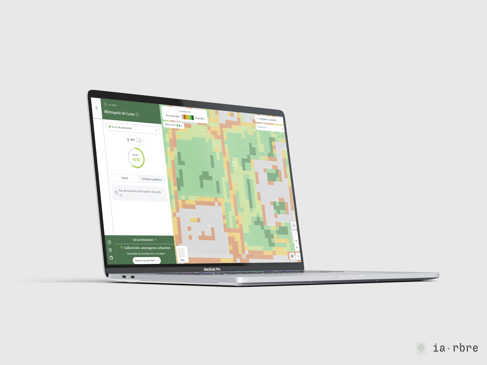

C'est  [Exo-Dev](https://exo-dev.fr/) qui mené ce travail à l'origine en 2022 pour le compte d'une expérimentation de la [Datagora](https://datagora.erasme.org/projets/calque-de-plantabilite/).

L'idée de l'expérimentation vient d'une ambition de la Métropole de Lyon de p**lanter 300 000 arbres d'ici 2030** dans le cadre de son plan Nature. L'objectif est de favoriser l'adaptation de la ville au changement climatique, améliorer la qualité de l'air et renforcer la biodiversité.

Planter massivement des arbres en ville ? Un beau projet, mais pas si simple à mettre en œuvre !

En ville, on ne plante pas n'importe où il y a beaucoup de contraintes :
➡️ réseaux souterrains,
➡️ voirie,
➡️ voies ferrées,
➡️ tramways,
➡️ bâtiments...

### 🌱 Une carte intelligente pour planter là où c'est vraiment possible

Pour relever ce défi, Exo-Dev s'est appuyée sur l'**open data** et l'expertise des acteurs de terrains de la Métropole pour créer un outil innovant : **un calque de "plantabilité" du territoire**. L'idée ? Croiser des dizaines de données existantes (voirie, arbres, bâtiments, rails, etc.) pour repérer les zones **où il est possible de planter...** et celles à éviter.

✅ **35 jeux de données analysés**
✅ **Une donnée ouverte, accessible à tous et toutes**

###

### 🌍 Planter mieux, planter ensemble

Grâce à cette approche innovante, la Métropole de Lyon s'assure que chaque arbre planté compte vraiment. Une démarche exemplaire où **la donnée devient un levier pour faire grandir la ville... et ses forêts urbaines.**

Plus de détails peuvent être trouvés dans la [fiche descriptive du projet](https://documents.exo-dev.fr/notice_utilisation_calque_plantabilite_lyon_V1.pdf) par Exo-Dev.
