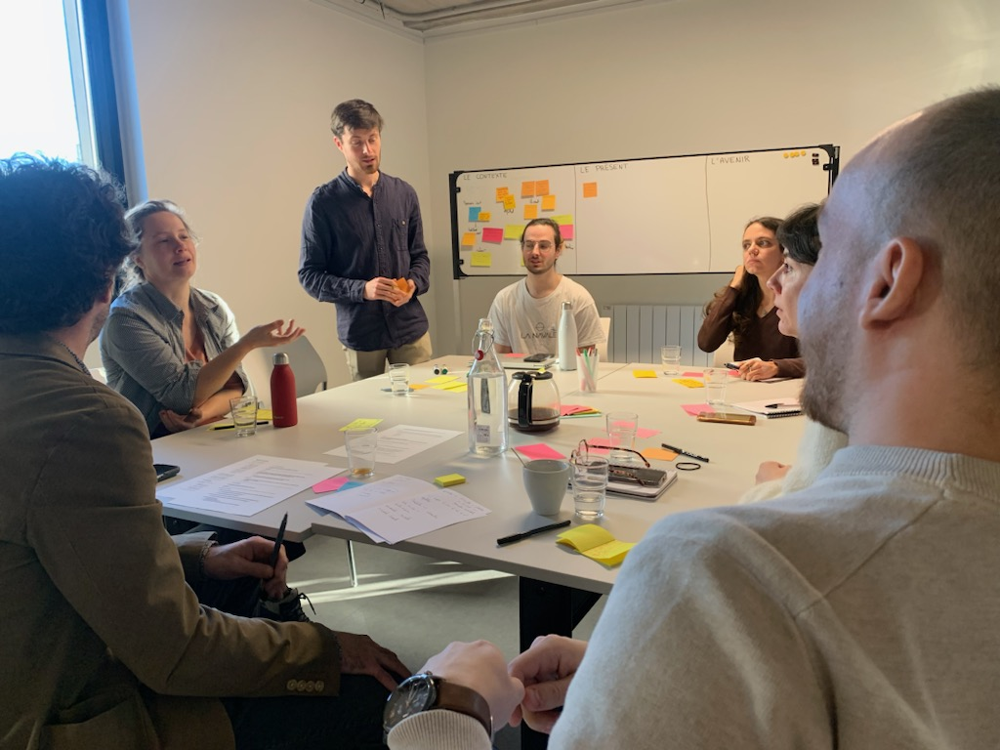

Le 29 janvier, le séminaire marquant la fin de la première année de projet d’**IA·rbre** a marqué une étape clé pour notre plateforme open source dédiée à l’adaptation et à l’atténuation climatique. 

7 communes, plusieurs directions métropolitaines et des partenaires se sont réunis pour découvrir l’outil, échanger sur ses fonctionnalités et co-construire ses prochaines évolutions. Après une présentation globale de la démarche et de la plateforme, des **ateliers collaboratifs** ont permis de dégager des pistes prometteuses pour enrichir IA.rbre : nouvelles données, fonctionnalités ciblées, et améliorations ergonomiques.

**Vous aussi, vous souhaitez contribuer ?** Que ce soit pour partager un besoin, proposer une idée ou participer à la réflexion, [**envoyez nous un message**](mailto:contact@telescoop.fr) pour alimenter la feuille de route d’IA.rbre (contact@telescoop.fr).
